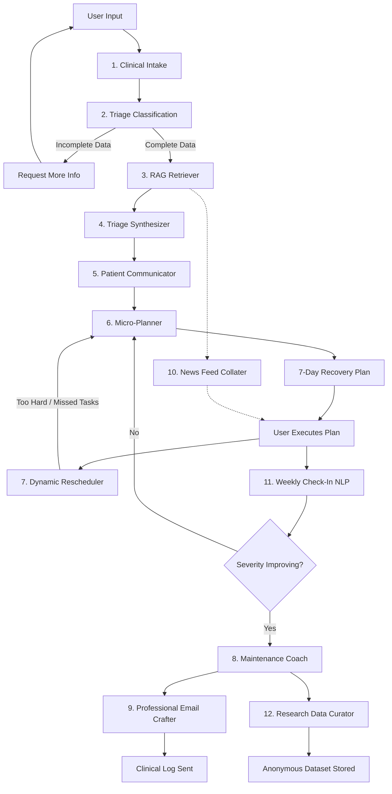

# ✨ The Vitality Hub (Aura: Your Intelligent Health Sanctuary)

## 1) What is The Vitality Hub All About

The Vitality Hub is an advanced, production-grade clinical orchestration and mental health sanctuary built to bridge the gap between medical advice and daily execution. Powered by a sophisticated multi-agent AI architecture (using OpenAI's GPT-4o-mini structured outputs), a Streamlit front-end, and seamless live integrations with Google Workspace and Microsoft Graph APIs, it functions as a highly personalized, 24/7 care team.

At its core, The Vitality Hub ingests unstructured patient data — whether typed out in moments of distress or uploaded via complex medical documents and prescriptions and transforms it into a structured, easily digestible reality for the user. It does not just provide a static diagnosis, it generates an empathetic understanding of the user's condition and automatically crafts a dynamic, highly interactive multi-week recovery schedule that actively syncs with the user's native calendar ecosystems.

## 2) Who Are The Target Audience

The Vitality Hub is designed for individuals seeking structured, supportive interventions for both physical and psychological well-being.

**Physical Health Focus:**
- Chronic Pain Sufferers: Individuals dealing with persistent issues like tension headaches, lower back pain, or neck strain who need consistent, daily management routines.
- Post-Consultation Patients: Users who have received medical advice or prescriptions but struggle to implement the lifestyle changes (e.g., diet, hydration, stretches) into their daily schedules.
- Desk-Bound Professionals: Corporate workers experiencing sedentary lifestyle symptoms needing micro-breaks, posture correction, and ergonomic interventions.

**Mental Health Focus:**
- High-Stress Professionals: Individuals experiencing severe professional burnout, chronic exhaustion, and an inability to disconnect from work.
- Anxiety & Insomnia Sufferers: People dealing with racing thoughts, generalized anxiety, or poor sleep hygiene who need structured evening routines and grounding exercises.
- Those Lacking Access to Immediate Care: Individuals who need a structured, empathetic sounding board and actionable steps while waiting for professional medical or psychological appointments.

## 3) What Problems The Vitality Hub Is Trying To Solve

The healthcare industry excels at diagnosis but often struggles with the "last mile" of patient care: daily execution. Patients are frequently handed a list of lifestyle changes, stretching routines, or mindfulness practices, only to return home and become overwhelmed by the friction of implementation. Without a structured way to break these broad goals into daily, actionable habits, adherence drops significantly, leading to prolonged recovery times and worsening chronic conditions. The Vitality Hub solves this by doing the micro-planning for the patient, translating overwhelming medical advice into automated 1-hour calendar blocks.

Furthermore, managing one's health today is a deeply fragmented experience. A user might use one app to track symptoms, another to read health articles, a third to manage their calendar, and a physical folder to hold their medical PDFs. This disjointed approach causes fatigue. The Vitality Hub unifies this ecosystem. It acts as the intake clinician, the triage nurse, the empathetic therapist, the executive assistant, and the medical scribe all in one cohesive, single-pane-of-glass interface.

## 4) How The Vitality Hub Works

The interface is driven by a frictionless, conversational, and document-ready input system. Users navigate to the "Chat With Us" intake module where they can type freely about their physical or mental distress, or securely upload medical notes (PDFs, TXT) and images (prescriptions, diagnostic snapshots). The system securely parses this multi-modal input to identify primary concerns, physical/emotional indicators, and distress levels.

Once ingested, the underlying agent engine dynamically cross-references the user's symptoms against a curated medical database, filtering for safe, relevant literature. The interface then presents the user with a highly empathetic, jargon-free summary of their prospective conditions and the underlying mechanisms causing them. Instead of leaving the user to figure out the next steps, the UI immediately prompts the creation of an interactive 7-day action plan.

This action plan is where the true utility shines. With a single click, users can authenticate via Google or Microsoft, mapping their custom daily health tasks directly into their personal calendars (Gmail or Outlook). Over the course of the week, users return to the interface to check off tasks or flag them as "Missed" or "Too Hard." If a task is too difficult, the system’s dynamic rescheduler kicks in, softening the routine and updating the live calendar automatically. At the end of a 4-week cycle, the system analyzes the user's progress, determines if they have safely recovered or require human medical intervention, and drafts a professional HTML export of their entire journey for their primary care physician.

## 5) Agents Being Used

The system utilizes 12 distinct AI agents, operating in a strict, sequential pipeline to ensure clinical safety and data integrity. (Note: Agent numbers map to their logical sequence in the architecture).

<table>
  <thead>
    <tr>
      <th>Agent #</th>
      <th>Agent Name</th>
      <th>Purpose</th>
      <th>How It Works</th>
    </tr>
  </thead>
  <tbody>
    <tr>
      <td>1</td>
      <td><strong>Clinical Intake</strong></td>
      <td>Data extraction and symptom structuring</td>
      <td>Ingests raw text and images, extracting explicit symptoms, duration, and severity into a structured JSON schema while validating completeness of the provided context.</td>
    </tr>
    <tr>
      <td>2</td>
      <td><strong>Triage Classification</strong></td>
      <td>Routing and safety flagging</td>
      <td>Evaluates intake data for severity, risk factors, and comorbidities, then routes users to physical health, mental health, or intersectional care pathways.</td>
    </tr>
    <tr>
      <td>3</td>
      <td><strong>RAG Retriever</strong></td>
      <td>Contextual knowledge fetching</td>
      <td>Retrieves relevant medical literature, clinical guidelines, and evidence-based references based on the triage classification.</td>
    </tr>
    <tr>
      <td>4</td>
      <td><strong>Triage Synthesizer</strong></td>
      <td>Diagnostic reasoning</td>
      <td>Combines patient intake data with retrieved medical knowledge to generate potential conditions and explain underlying biological or psychological mechanisms.</td>
    </tr>
    <tr>
      <td>5</td>
      <td><strong>Patient Communicator</strong></td>
      <td>Empathetic translation</td>
      <td>Converts clinical findings and recommendations into supportive, easy-to-understand language suitable for patient-facing interfaces.</td>
    </tr>
    <tr>
      <td>6</td>
      <td><strong>Micro-Planner</strong></td>
      <td>Schedule generation</td>
      <td>Breaks recommendations into exactly seven actionable daily tasks and formats them for integration with Google Calendar or Microsoft Outlook.</td>
    </tr>
    <tr>
      <td>7</td>
      <td><strong>Dynamic Rescheduler</strong></td>
      <td>Plan recalibration</td>
      <td>Processes user feedback such as missed tasks or difficulty levels and regenerates the remaining schedule with adjusted recommendations.</td>
    </tr>
    <tr>
      <td>8</td>
      <td><strong>Maintenance Coach</strong></td>
      <td>Lifecycle conclusion</td>
      <td>Reviews recovery metrics, provides maintenance guidance for successful outcomes, or recommends escalation to professional care when necessary.</td>
    </tr>
    <tr>
      <td>9</td>
      <td><strong>Professional Email Crafter</strong></td>
      <td>Record compilation</td>
      <td>Functions as a medical scribe by compiling symptoms, progress logs, and schedules into a professional HTML-formatted report for sharing with healthcare providers.</td>
    </tr>
    <tr>
      <td>10</td>
      <td><strong>News Feed Collater</strong></td>
      <td>Curated reading matching</td>
      <td>Selects six credible and relevant health-related articles based on the user's symptoms and generates personalized summaries.</td>
    </tr>
    <tr>
      <td>11</td>
      <td><strong>Weekly Check-In NLP</strong></td>
      <td>Sentiment and severity tracking</td>
      <td>Analyzes weekly user reflections using NLP techniques to estimate distress severity (0–10) and monitor recovery trends over time.</td>
    </tr>
    <tr>
      <td>12</td>
      <td><strong>Research Data Curator</strong></td>
      <td>Anonymized data export</td>
      <td>With user consent, transforms longitudinal health journey data into structured datasets and exports them as secure XLSX files for research purposes.</td>
    </tr>
  </tbody>
</table>

## 6) The Agent Pipeline Process

The system follows a strict, gated workflow. Here is the step-by-step pipeline process:

### Phase 1: Ingestion & Evaluation
- User provides input $\rightarrow$ Agent 1 (Intake) extracts raw data.
- Data passes to Agent 2 (Triage) $\rightarrow$ If data is incomplete, the pipeline halts and asks the user for more details. If complete, it determines the clinical routing.

### Phase 2: Synthesis & Translation
- Agent 3 (RAG) fetches literature based on the route $\rightarrow$ Passes to Agent 4 (Synthesizer) to establish potential conditions.
- Agent 5 (Communicator) translates the clinical findings into empathetic user-facing UI text.

### Phase 3: Execution & Tracking
- Agent 6 (Planner) builds the initial 7-day calendar sync.
- Mid-week feedback loop: If the user struggles, Agent 7 (Rescheduler) overwrites the calendar with modified tasks.
- End-of-week loop: Agent 11 (Check-In) reads the user's reflection to score severity. If severity remains high, the loop repeats (back to Agent 6 for a new week).

### Phase 4: Offboarding & Handoff
- Once severity drops or the 4-week maximum is reached, Agent 8 (Coach) provides final next steps.
- Agent 9 (Email Crafter) sends the clinical log to the user's email.
- Concurrently, Agent 10 (News) provides passive reading material and Agent 12 (Data Curator) archives the anonymous lifecycle to an Excel database.




## 7) How Can This App Benefit The Healthcare Industry

### Locally (Singapore):
In a fast-paced corporate environment like Singapore, chronic stress, burnout and sedentary lifestyle ailments are highly prevalent, while primary care polyclinics and institutions like the Institute of Mental Health (IMH) frequently face high patient loads. The Vitality Hub serves as a crucial intervention. By providing immediate, structured triage and lifestyle management for mild-to-moderate physical and mental distress, it can significantly reduce the burden on local clinical infrastructure. It empowers citizens to take preemptive action on their health before their conditions escalate to a point requiring emergency or specialized public healthcare intervention.

### Globally:
On a global scale, the disparity in access to continuous healthcare, particularly mental health professionals and chronic care management, is staggering. The Vitality Hub democratizes access to high-quality, structured post-consultation care. For medical professionals worldwide, it acts as a force multiplier -  doctors can recommend the platform to ensure their patients actually execute their prescribed lifestyle adjustments between infrequent visits. The automated, professional email logs generated by the system also provide global health practitioners with highly accurate, multi-week behavioral data that is otherwise impossible to track manually.

## 8) Steps To Use The App

### 1. Prerequisites
- Ensure you have Python 3.9+ installed on your machine.
- Have an active OpenAI Developer account for API access.
- Have active Google Cloud and Microsoft Entra ID (Azure) accounts for calendar API integrations.

### 2. Clone the Repository
- Open your terminal and clone the repository:
```bash
git clone https://github.com/your-username/vitality-hub.git
cd vitality-hub
```

### 3. Install Dependencies
- Ensure your requirements.txt file is present in the root directory. It should contain the core libraries (streamlit, openai, pydantic, pandas, altair, msal, google-api-python-client, google-auth, etc.). Install them by running:
```bash
pip install -r requirements.txt
```

### 4. OpenAI API Key Setup
- Navigate to the OpenAI Developer Platform and generate a new secret key.
- Replace the placeholder in the openai_api_key variable within healthcare_check.py (or ideally, set it as an environment variable for security).

### 5. Google Workspace Setup (Gmail & Calendar)
- Go to the Google Cloud Console. Enable the Google Calendar API and Gmail API.
- Create an OAuth 2.0 Client ID (Desktop App).
- Download the JSON file, rename it exactly to credentials.json, and place it in the root folder of the project.
- Note: On your first run, a browser window will open asking you to authenticate. This will generate a token.json file for future automated access.

### 6. Microsoft Graph API Setup (Outlook & Teams)
- Log into the Microsoft Entra ID (Azure) Portal.
- Register a new application and configure the platform for Mobile/Desktop apps (http://localhost).
- Under API Permissions, grant Calendars.ReadWrite and Mail.Send.
- Copy your Application (Client) ID and replace the microsoft_client_id string in the application code.

### 7. Run the Application
- Once all API keys and dependencies are configured, launch the application locally:
```bash
-m streamlit run healthcare_check.py
```
